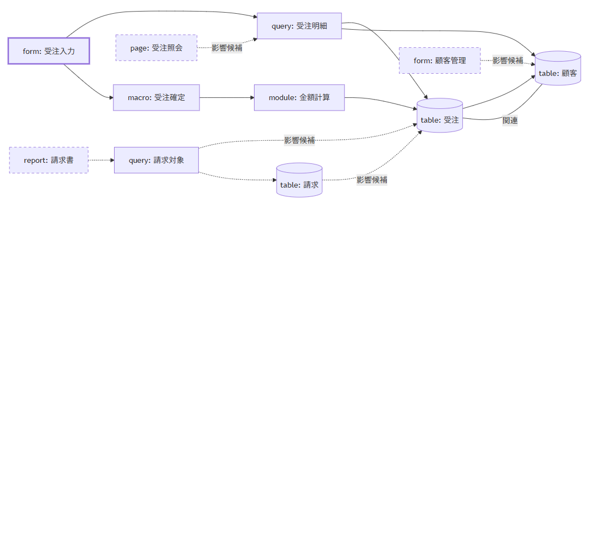
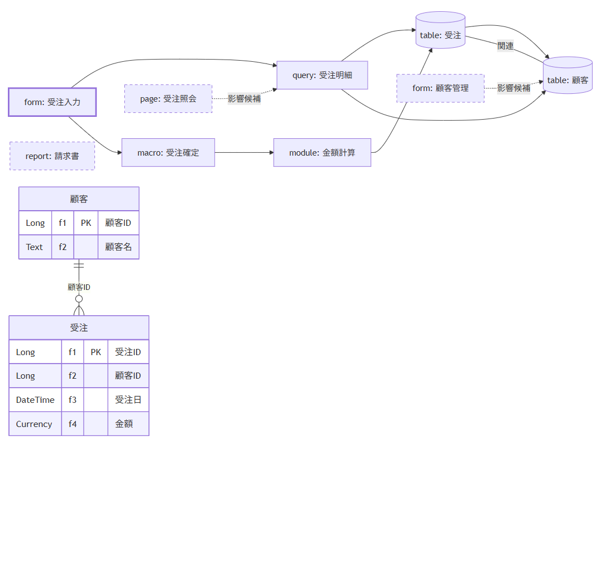

# Access2Future

Microsoft Access で動いている業務システムを、今の現場に合う仕組み（Webアプリ、Excel、Googleスプレッドシート + GAS など）へ作り替えるための**移行計画づくり支援ツール**です。

Access ファイルの構造をこのPCの中だけで解析し、移したいフォーム・帳票と使い方を選ぶと、依存関係・影響範囲・要件候補・移行手順・検証手順をまとめた**移行計画の草案**を出力します。

> 現在は初版「A：移行計画を作れる版」です。移行先アプリのコード生成やデータ移行は今後の範囲です。

## できること

- `.accdb` / `.mdb` のメタデータ解析（テーブル、クエリ、フォーム、レポート、マクロ、モジュール、Data Access Pages）
- VBA の静的解析（手続き名、呼び出し、Access オブジェクト参照を依存候補として抽出。コードは実行しません）
- フロントエンド／バックエンドに分かれた構成の統合（明示されたリンク情報が一致するものだけを結びます）
- 移行対象（フォーム・帳票・ページ）の選択と、依存資産・共有資産・未選択機能への影響の表示
- 利用形態（人数、場所、オフライン、同時編集、権限、既存Accessとの共存）の確認
- 移行先候補（Webアプリ / Excel / Googleスプレッドシート + GAS）の目安の表示
- 業務フロー候補（依存図）と ER 図を画面内に表示し、Markdown / JSON にも Mermaid 形式で出力
- 計画を Markdown（人が読む用）と JSON（AI・スクリプト向け）で保存

## 安全性について

- サーバーは `127.0.0.1` だけで待ち受け、ファイルは外部に送信しません。
- **テーブルの行データは読み出しません。** 解析するのは構造（メタデータ）だけです。
- VBA は実行せず、ソースそのものは API の応答に含めません。
- 元の Access ファイルは変更・削除しません。
- リンク先のデータベースは自動では開きません。

## Web版の必要なもの

- Node.js 22 以上（`npm start` でWeb版を使う場合。npm の実行時依存パッケージはありません）
- Access ファイルを解析する場合: Windows と Microsoft Access
  - Access がない環境でも、JSON 解析資料か合成サンプルで操作を試せます。

## 使い方

```sh
git clone https://github.com/nyattoh/access2future.git
cd access2future
npm start
```

ブラウザで http://127.0.0.1:7331 を開き、画面の5つの工程に沿って進みます。

1. **データベースを解析**: Access ファイルを1つまたは2つ選んで「解析開始」を押します（1ファイル最大64MiB、制限時間15分）。
2. **移行対象を選択**: 移したいフォーム・帳票・ページを選びます。
3. **利用形態を確認**: 人数、場所、通信、同時編集、権限、既存Accessとの共存を答えます。
4. **影響を確認**: 依存関係を確認し、移行先を選びます。
5. **計画を作成**: 草案と画面内の業務フロー候補図・ER図を確認し、`access-migration-plan.md` / `access-migration-plan.json` を保存します。

### 出力ファイルの使い方

| ファイル | 用途 |
|---|---|
| `access-migration-plan.md` | 関係者が読んで要件を確認・承認する、未解決事項を確認リストとして使う、見積もりの土台にする |
| `access-migration-plan.json` | Claude Code などのAIに渡して実装計画やコードを作らせる、スクリプトで課題管理表に流し込む |

### 図のサンプル

下図は合成サンプルから出力した例です。アプリ画面にも両方の図を表示します。業務手順を確定した図ではなく、取得できた依存候補とテーブル関連を示します。





要件は自動では承認されません。出力は**草案**であり、人が確認して確定させる前提です。

詳しい操作は [docs/usage.md](docs/usage.md) を参照してください。

## テスト

```sh
npm test              # 単体・結合テスト
npm run test:native   # Windows + Access 環境で合成ファイルを作って解析する試験
```

ブラウザ試験（`python -X utf8 tests/browser-flow.py`）を動かすには、別途 Python、Playwright、Chromium が必要です。

## Windows デスクトップ版（開発中）

Windows版はRust/Tauri 2で専用ウィンドウを開き、既存のHTML/CSS/JavaScript画面をWebView2で表示します。解析・依存分析・計画生成はRust側で処理し、Accessの構造抽出には `scripts/export-access.ps1` と `scripts/vba-analysis.ps1` を同梱してWindows PowerShell 5.1から呼び出します。Node.jsのNode runtimeはデスクトップ版の実行時依存にしません。

開発にはWindows 10/11 x64、Rust stable MSVC、Visual Studio C++ Build Tools、WebView2 Runtimeが必要です。初回インストーラーはNSISのユーザー単位 `-setup.exe` を作る設定です。WebView2 Evergreen RuntimeがないPCではインストール時にMicrosoftから取得するため、その時点でネット接続が必要です。Accessファイルの解析には対象PCのデスクトップ版Microsoft Accessが必要で、Access Runtimeだけの構成は未確認です。

```powershell
npm run desktop:dev
npm run test:rust
npm run desktop:build
```

`npm` を使わない場合は、リポジトリのルートで `cargo tauri dev`、`cargo test --manifest-path src-tauri/Cargo.toml`、`cargo tauri build` を実行します。

インストーラーは `src-tauri/target/release/bundle/nsis/` に出力されます。署名証明書は設定していないため、生成物は未署名です。公開配布前に対象端末でインストール、起動、WebView2表示、計画の保存、COM解析、中止・一時ファイル削除を確認してください。

## 制約

- 動的SQLや実行時に決まる参照は解析できないため、未解決事項として残します。依存関係を完全に取得できる保証はありません。
- Access Data Access Pages は旧形式のため、非対応の阻害事項として扱います。
- 移行先の推奨は条件に基づく目安です。

## ドキュメント

- [使い方](docs/usage.md)
- [入出力の契約](docs/contracts.md)
- [実装・検証結果と制約](docs/implementation-status.md)
- [実装計画](docs/implementation-plan.md)
- [用語集](CONTEXT.md)

## 今後の構想

要件定義、移行先アプリの実装、データ移行、移行後の検証まで支援範囲を広げることを検討しています。自動化だけでは対応しきれないケースへの相談・実装支援も検討中です。

## ライセンス

このプロジェクトは [Apache License 2.0](LICENSE) のもとで提供します。依存ソフトウェアと同梱資産には、それぞれのライセンス条件が適用されます。
